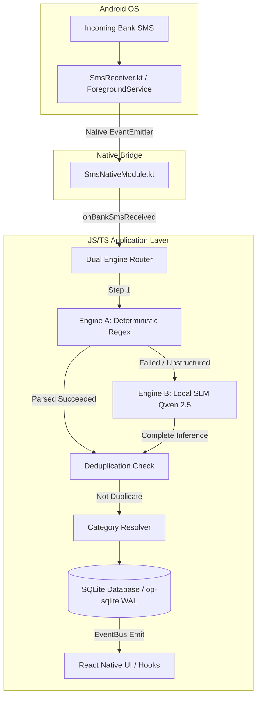

# 💸 BudgetBuddy

<div align="center">


**Privacy-First, Zero-Cloud Personal Finance Assistant for Android**  
*Automatically track expenses, monitor budgets, and analyze spending straight from bank SMS — with 100% local storage and optional on-device AI.*

</div>

---

## 🌟 Overview

**BudgetBuddy** is designed for users who want effortless, automated expense tracking without giving up financial privacy. Unlike cloud-based money managers that upload personal SMS messages and bank statements to remote servers, BudgetBuddy operates **entirely on your phone**.

- 🔒 **100% Local & Private**: No cloud accounts, no login, no remote servers, no data collection.
- ⚡ **Instant Automatic Tracking**: Background Android receiver parses incoming bank SMS in real-time.
- 🧮 **Paise-Integer Precision**: Guaranteed financial calculations without floating-point rounding bugs.
- 🤖 **Dual-Engine Architecture**: 
  - **Engine A (Deterministic Regex)**: Ultra-fast (< 5ms) recognition for standard Indian bank SMS.
  - **Engine B (On-Device SLM)**: Local Small Language Model (`Qwen 2.5 0.5B`) running via C++ `llama.rn` for complex/unstructured SMS fallback.

---

## 📱 Non-Technical User Guide: How Everyday Users Use BudgetBuddy

BudgetBuddy is built as an intuitive, consumer-ready Android application. **No technical knowledge, developer tools, command line, or terminal commands are ever required for everyday users.**

```
+-------------------------------------------------------------------------------+
|                             3-STEP USER EXPERIENCE                            |
+-------------------------------------------------------------------------------+
|                                                                               |
|   1. Install & Launch           2. Grant Permission          3. Automated!      |
|   +-------------------+        +-------------------+     +------------------+ |
|   | Download APK from |  --->  | Tap "Allow" when  | --->| Spending auto-   | |
|   | Store / Website   |        | prompted for SMS  |     | tracks in real   | |
|   +-------------------+        +-------------------+     | time on dashboard| |
|                                                          +------------------+ |
+-------------------------------------------------------------------------------+
```

### 1️⃣ Installation
Users simply install the **BudgetBuddy APK** directly onto their Android phone (or install via Google Play / F-Droid in production).

### 2️⃣ First Launch & Onboarding (30 Seconds)
1. Open BudgetBuddy.
2. Tap **Get Started**.
3. Tap **Grant SMS Access** — your Android phone will ask *"Allow BudgetBuddy to receive and read SMS messages?"* Tap **Allow**.
4. Tap **Import SMS History** — BudgetBuddy immediately scans past bank messages in your inbox and populates your spending history for the current month!

### 3️⃣ Everyday Hands-Free Operation
- **Nothing to type or open**: Whenever you buy food on Swiggy, pay a bill, order on Amazon, or send money via UPI, your bank sends a notification SMS.
- BudgetBuddy detects the SMS in the background, extracts the amount, merchant, and category, and updates your Dashboard automatically.
- **Budget Alerts**: If you cross 80% or 100% of your set category budget, BudgetBuddy visually alerts you on the dashboard.

### 4️⃣ Optional 1-Tap AI Model Download (In-App)
- **Engine A (Regex)** works out of the box with **zero downloads** and parses 95%+ of standard Indian bank SMS.
- If users want the optional AI Engine B for non-standard messages:
  1. Open **Settings ⚙️**.
  2. Tap **"Download AI Model (~398 MB)"**.
  3. The app downloads and activates the local AI model directly inside the app with a live progress bar.

---

## 🏗️ System Architecture



---

## 📊 Feature Comparison & Capabilities

| Feature | BudgetBuddy (On-Device) | Traditional Cloud Apps |
| :--- | :---: | :---: |
| **SMS Data Storage** | 100% On-Device SQLite | Remote Cloud Servers |
| **Privacy Risk** | Zero (Network requests blocked) | High (Data breach / resale) |
| **Offline Functionality** | Fully Functional Offline | Limited / Requires Internet |
| **AI Parsing** | On-Device SLM (CPU GGUF) | Cloud API calls / Third-party |
| **Financial Precision** | Integer Paise Math (Exact) | Standard Floating Point |
| **Setup Effort** | 1-Tap Permission Grant | Account Creation & OAuth |

---

## 🛠️ Supported Indian Banks & Formats

Engine A & B automatically identify transactions from major banks, UPI providers, and merchants:

- **Banks**: HDFC Bank, ICICI Bank, State Bank of India (SBI), Axis Bank, Kotak Mahindra, Punjab National Bank (PNB), Bank of Baroda (BOB), IDFC First, IndusInd, Union Bank, YES Bank, Canara Bank.
- **Payment Apps & Wallets**: Google Pay, PhonePe, Paytm, Amazon Pay, BHIM UPI, Airtel Payments Bank.
- **Popular Merchants**: Swiggy, Zomato, Uber, Ola, Rapido, Amazon, Flipkart, Myntra, Blinkit, Zepto, BigBasket, Apollo Pharmacy, BookMyShow, Netflix.

---

## 💻 Developer & Emulator Setup Guide

For developers, contributors, or reviewers running BudgetBuddy on **Android Emulators** or **BlueStacks**:

### 1. Repository Setup
```bash
git clone https://github.com/RohanMali2003/BudgetBuddy.git
cd BudgetBuddy
npm install
```

### 2. Connect Emulator / BlueStacks
- **BlueStacks**: Enable ADB in Settings → Preferences → Run `adb connect localhost:5555`
- **Android Studio Emulator**: Start emulator from AVD Manager
- **Physical Phone**: Connect USB cable with USB Debugging enabled

### 3. Build and Launch
```bash
# Start Metro bundler
npm start

# In a separate terminal, build and deploy Android app
npm run android
```

---

## 🧪 Developer Simulation & Testing (ADB CLI)

When testing inside emulators without SIM cards or live cellular network connections, you can simulate incoming bank SMS using ADB commands:

### Sample 1: HDFC Bank Debit (Engine A)
```powershell
adb emu sms send HDFCBK "Your a/c XX4321 was debited by Rs.349.00 on 31-Jul-26 for UPI txn to Swiggy. Avl Bal: Rs.14250.00"
```

### Sample 2: ICICI Credit Card Purchase (Engine A)
```powershell
adb emu sms send ICICIB "INR 2499.00 spent on HDFC Bank Card XX9012 at AMAZON on 2026-07-31. Avl Limit: Rs.45000.00"
```

### Sample 3: Salary Credit (Engine A)
```powershell
adb emu sms send SBIINB "Rs 75,000.00 credited to a/c XX5678 on 31-JUL-26 by NEFT SALARY. Avl Bal Rs 1,12,000.00"
```

### Sample 4: Unstructured Payment (Engine B Fallback)
```powershell
adb emu sms send PAYTM "Received Rs 180.00 in your account from Alex via UPI payment. Ref ID 981273."
```

---

## 🔬 Empirical Evaluation & Independent Benchmark Auditor

BudgetBuddy includes an independent, read-only benchmark auditor script to evaluate the deterministic regex engine (Engine A) and SLM fallback against synthetic SMS transaction datasets without modifying ground truth labels.

### 1. Dataset Generation
Generate 250 diverse synthetic SMS samples (spanning standard debits, NEFT/UPI, unstructured Hinglish/typos, and OTP noise):
```bash
node scripts/generateRobustDataset.js
```

### 2. Run Independent Benchmark Audit
Execute the read-only auditor suite using Jest:
```bash
npm run audit
```

The auditor script pins the dataset via **SHA-256 hash**, checks Engine A accuracy against shipping regex patterns (`src/engines/regexParser.ts`), recomputes Wilson 95% confidence intervals from first principles, flags any parsing anomalies, and outputs a detailed per-sample audit log to `audit_output/per_sample_audit.json`.

---

## 🔒 Security & Privacy Enforcement

BudgetBuddy enforces privacy at both the application and network layer:

1. **Native Network Blocker**: A custom OkHttp `NetworkBlockInterceptor` is registered in `MainApplication.kt` that intercepts and drops 100% of outgoing HTTP/HTTPS network requests from the app layer.
2. **No Analytics / Telemetry**: Zero Google Analytics, Firebase, Sentry, or tracking SDKs included in dependencies.
3. **Local Database**: All transactions and budgets are stored in an encrypted/local SQLite database using WAL mode (`@op-engineering/op-sqlite`).

---

## 📜 License

Distributed under the **MIT License**. See `LICENSE` for more information.

---

<div align="center">

Built with ❤️ by Rohan Mali • **BudgetBuddy — Zero Cloud. Total Control.**

</div>
