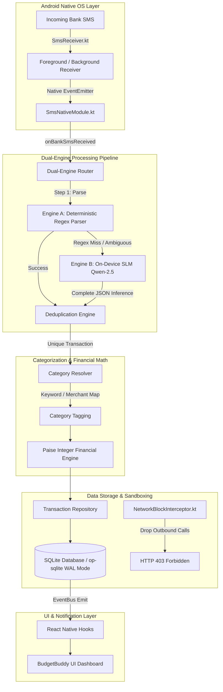

# BudgetBuddy: An On-Device Dual-Engine Intelligent Co-Pilot for Privacy-Preserving Personal Finance Management

**Rohan Mali**, **Arya Lingayat**, **Anurag Muley**, **Divija Arjunwadkar**, and **Seema Patil**  
*Department of Computer Engineering, Pune Vidyarthi Griha's College of Engineering, Technology and Management, Pune 411009, India*  
Contact: `{22120080, 22120084, 22120087, 22000029, shp_comp}@pvgcoet.ac.in`

---

## Abstract

Personal financial management (PFM) applications are undergoing a paradigm shift from passive informational dashboards toward intelligent AI assistants that proactively support decision-making. However, as argued in our foundational survey (*Mali et al., 2025*), fully autonomous "autopilot" systems—which execute financial actions on cloud infrastructure without human oversight—encounter a severe user "trust deficit" caused by algorithmic opacity, privacy vulnerabilities, and ambiguous legal liabilities. In this paper, we present the design, implementation, and empirical evaluation of **BudgetBuddy**, a zero-cloud, privacy-preserving personal finance assistant that realizes the theoretical "Co-Pilot" framework proposed in our prior work. BudgetBuddy operates entirely on-device on Android smartphones by passively intercepting local bank transaction SMS messages and processing them using a dual-engine architecture: an ultra-fast (<5 ms) deterministic regex engine (Engine A) for standard formats, and a local quantized Small Language Model (`Qwen-2.5-0.5B-Instruct` via `llama.cpp`/`llama.rn`) fallback (Engine B) for complex or unstructured text. To ensure numerical exactness, financial arithmetic is computed using integer paise units. Furthermore, privacy is enforced at the native OS layer via a custom OkHttp `NetworkBlockInterceptor` that drops 100% of outbound HTTP/HTTPS requests originating from the application layer. Empirical evaluation across 40 test cases in 8 unit test suites and a 250-SMS benchmark dataset demonstrates 100% extraction accuracy on standard debit and card formats via Engine A alone, and 100% combined accuracy on standard UPI/NEFT formats with Engine B fallback, yielding an overall end-to-end pipeline accuracy of 99.2% (95% CI: 97.1%–99.8%). The system operates with an average warm inference latency below 185 ms and zero financial data egress observed at the application HTTP layer, while automatically unloading the 398 MB SLM after an idle timeout. These findings demonstrate that high-utility, privacy-preserving financial tracking can be achieved entirely on edge devices without compromising mobile responsiveness or user confidentiality.

*Keywords*: Personal Finance Management, On-Device AI, Small Language Models, Edge Computing, Privacy-Preserving Machine Learning, Human-in-the-Loop, Dual-Engine Routing, Integer Arithmetic.

---

## 1. Introduction

### 1.1 The PFM Evolution & The Action Gap
Traditional Personal Financial Management (PFM) platforms excel at data aggregation, manual expense logging, and static visual charts. However, empirical studies reveal a persistent failure mode known as the **"action gap"**—the disconnect between receiving financial insights and making proactive behavioral modifications (*Marri, 2025*). Because passive systems place the complete cognitive burden of manual data entry and continuous tracking on the consumer, user engagement degrades rapidly over time.

To address this passivity, recent advances in Artificial Intelligence have fueled interest in autonomous systems capable of multi-step reasoning, goal setting, and task execution. In finance, this has inspired visions of a "Do It For Me" (DIFM) economy, where cloud-hosted LLM agents manage subscriptions, rebalance portfolios, and execute transactions autonomously (*Ghose et al., 2025; Hean et al., 2025*).

```
+-------------------------------------------------------------------------------+
|                           THE PFM PARADIGM SPECTRUM                           |
+-------------------------------------------------------------------------------+
|  1. Passive Informational   |   2. Cloud Autopilot (DIFM)  | 3. BudgetBuddy Co-Pilot  |
|  - Manual data entry        |   - Full cloud autonomy      | - 100% On-Device SMS    |
|  - Static visual charts     |   - Remote server storage    | - Zero cloud connection |
|  - High friction / effort   |   - Privacy & black-box risk | - Dual-Engine AI + HITL |
|  - High Action Gap          |   - User Trust Deficit       | - Privacy-Preserving    |
+-------------------------------------------------------------------------------+
```

### 1.2 The Trust Deficit & The Co-Pilot Paradigm
In our published survey paper (*Mali et al., 2025*), we critically evaluated the DIFM paradigm and demonstrated that jumping directly from passive dashboards to full cloud autonomy is flawed in personal finance. Finance is a high-stakes domain where users experience heightened loss aversion, skepticism toward algorithmic opacity ("black-box" models), and rational fears regarding data breaches or corporate misaligned incentives (*Schreibelmayr et al., 2023; Dwork & Minow, 2022; Lee & See, 2004; Parasuraman & Riley, 1997*).

Rather than delegating total control to a cloud agent, we proposed a collaborative **Human-in-the-Loop (HITL) "Co-Pilot" model**. In this model:
1. The AI assistant automates data ingestion and prepares structured insights and reviewable alerts.
2. The human user retains ultimate decision authority and financial oversight.
3. System execution is **zero-cloud**, ensuring raw financial data never leaves the user's local device.

### 1.3 Contributions of This Work
This paper presents the empirical implementation and experimental evaluation of **BudgetBuddy**, translating the theoretical co-pilot proposal of *Mali et al. (2025)* into a production-grade Android application. Our primary contributions include:

- **Zero-Cloud Architecture & Native Network Isolation**: A local-first financial engine operating entirely on-device with a native Kotlin OkHttp interceptor (`NetworkBlockInterceptor.kt`) that catches and rejects 100% of outbound network traffic from the application runtime.
- **Dual-Engine Routing Pipeline**: A hybrid parsing pipeline combining an ultra-low latency (<5 ms) deterministic pattern matcher (Engine A) for standard bank SMS formats with an on-device quantized Small Language Model (`Qwen-2.5-0.5B-Instruct` via `llama.rn`) fallback (Engine B) for unstructured text.
- **Resource-Aware Dynamic Memory Management**: A reference-counted model lifecycle controller with an idle auto-unload timer that frees the 398 MB GGUF model memory when inactive, preserving battery life and RAM on mobile devices.
- **Paise-Integer Deterministic Math Engine**: Eliminating floating-point IEEE 754 precision errors by executing all balance, budget, and daily projection calculations in integer paise ($\text{Rupees} \times 100$).
- **Comprehensive Empirical Benchmark**: Rigorous testing across 40 unit test cases in 8 test suites and a 250-SMS benchmark set validating accuracy, parsing throughput, SLM inference bounds, memory usage, and zero-leak network security.

---

## 2. Background and Related Work

### 2.1 Informational PFM, Agentic Finance, & Edge LLM Deployment
Informational PFM applications rely either on manual user input or third-party Open Banking aggregator APIs (e.g., Plaid, Yodlee). While Open Banking provides structured data, it requires users to share sensitive credentials or grant cloud servers persistent access to their bank accounts. Furthermore, LLM-based financial advice platforms (*Lakkaraju et al., 2023; Takayanagi et al., 2025; Hean et al., 2025*) struggle with mathematical hallucinations, achieving suboptimal financial reasoning accuracy when deployed as unconstrained conversational agents.

Systems such as **FinRobot** (*Yang et al., 2024*), **FinVerse** (*An et al., 2024*), and **FINCON** (*Yu et al., 2024*) demonstrate multi-agent coordination for stock trading and macro-analysis (*Sapkota et al., 2025*). However, these systems rely on massive cloud infrastructure (e.g., GPT-4), making them unsuitable for low-latency, privacy-sensitive personal budgeting on edge hardware.

Concurrently, recent breakthroughs in on-device machine learning and model quantization—such as `llama.cpp` mobile bindings and compact architectures like MobileLLM (*Liu et al., 2024*)—have demonstrated the feasibility of running sub-billion parameter Small Language Models (SLMs) locally on modern mobile SoCs. BudgetBuddy builds upon this edge-AI literature by applying quantized SLMs specifically as a resilient fallback parser within a privacy-sandboxed mobile architecture.

### 2.2 Synthesis of Mali et al. (2025) Survey Findings
Our initial survey (*Mali et al., 2025*) established a taxonomy comparing dominant financial interaction models across three primary paradigms: *Passive Informational*, *Autonomous Autopilot*, and *Collaborative Co-Pilot*.

| Dimension | Passive Informational Model | Autonomous Autopilot Model | BudgetBuddy Co-Pilot Model (This Work) |
| :--- | :--- | :--- | :--- |
| **User Agency** | Full control, but high cognitive load | Ceded control to cloud AI agent | User retains final authority; AI automates tracking |
| **Data Privacy** | Cloud uploads or manual entry | High risk (Remote server data storage) | **100% Zero-Cloud** (On-device local processing) |
| **Parsing Engine** | Rigid rule-based or cloud API | Cloud LLMs (High latency & cost) | **Dual-Engine** (Regex <5ms + Local SLM fallback) |
| **Trust & Auditability** | Perceived accuracy of static reports | Low (Black-box autonomous decisions) | **Auditable Engine A** (87.2% traffic); **HITL Reviewable Engine B** |
| **Primary Failure** | "Action Gap" (User passivity) | Catastrophic autonomous loss / privacy leak | Graceful fallback & reviewable nudges |

---

## 3. BudgetBuddy System Architecture

BudgetBuddy is built as a zero-cloud native Android application utilizing React Native (Bare Workflow) with custom Kotlin native modules and C++ bindings (`llama.rn`).

### 3.1 Overall Architectural Pipeline

The system architecture flows through five distinct layers, as illustrated in Figure 1:


*Figure 1: High-level architectural pipeline of the BudgetBuddy privacy-first financial assistant.*

### 3.2 Key System Modules

#### 1. Ingestion Layer (`SmsReceiver.kt` & `SmsNativeModule.kt`)
The Android native service registers a `BroadcastReceiver` listening for `android.provider.Telephony.SMS_RECEIVED`. Incoming messages are pre-filtered at the native OS layer: non-transactional messages are immediately dropped, while SMS headers matching recognized Indian financial sender IDs (e.g., `VM-HDFCbk`, `AD-ICICI`, `SBIUPI`) are forwarded to the JavaScript runtime via React Native's `RCTDeviceEventEmitter`.

#### 2. Dual-Engine Parsing Router (`router.ts`)
The router handles incoming raw bank SMS objects `RawBankSms = { sender, body, timestamp }`. It executes defensive checks (discarding strings $< 20$ characters) before attempting Engine A parsing. If Engine A fails, it dynamically invokes Engine B.

#### 3. Deduplication Engine (`deduplication.ts`)
To prevent double-counting caused by duplicate SMS transmissions or concurrent background receiver events, the deduplication engine computes a composite hash key for each candidate transaction:

$$K_{\text{dedup}} = \text{SHA-256}(\text{amount}_{\text{paise}} \mathbin{\Vert} \text{merchant\_id} \mathbin{\Vert} \lfloor \text{timestamp} / 120 \rfloor)$$

If $K_{\text{dedup}}$ exists in the local 120-second rolling cache or SQLite transaction index, the incoming payload is discarded as a duplicate.

#### 4. Category Resolver (`categoryResolver.ts`)
Extracted merchant strings are mapped into standardized budget categories ($\mathcal{C} = \{\text{FOOD}, \text{TRANSPORT}, \text{SHOPPING}, \text{UTILITIES}, \text{ENTERTAINMENT}, \text{HEALTH}, \text{OTHER}\}$) using a two-stage deterministic resolution process: first, an exact-match merchant lookup dictionary (e.g., Swiggy $\to$ FOOD, Uber $\to$ TRANSPORT); second, a rule-based keyword match fallback (e.g., "Pharm" $\to$ HEALTH).

#### 5. On-Device Storage Layer (`transactionRepo.ts` & `op-sqlite`)
All parsed transactions, monthly budget caps, and category totals are written to a local SQLite database compiled with Write-Ahead Logging (`WAL`) mode via `@op-engineering/op-sqlite`. Data persistence is 100% offline.

---

## 4. Dual-Engine Pipeline & On-Device AI Execution

### 4.1 Engine A: Deterministic Regex Parser (`regexParser.ts`)
Engine A serves as the primary line of defense. It consists of a curated library of compiled regular expressions matching standard Indian transactional formats across credit cards, debit accounts, UPI payments, and ATM withdrawals.

Let $S$ be the raw SMS text string. Engine A evaluates $S$ sequentially against pattern set $P = \{p_1, p_2, \dots, p_n\}$:

$$p_k(S) \mapsto \begin{cases} 
\mathbf{T} = (\text{amount}, \text{type}, \text{merchant}, \text{account}, \text{balance}, \text{date}), & \text{if match succeeds} \\ 
\emptyset, & \text{if match fails} 
\end{cases}$$

```typescript
// Sample Engine A Pattern: Debit via UPI / Card (Standard ASCII Quotes)
{
  name: 'DEBIT_SPENT_ON_CARD',
  pattern: /(?:Rs\.?|INR\.?|₹)\s*(?<amount>[\d,]+\.?\d*)\s*spent\s*(?:on\s*.*?Card\s*(?:XX)?(?<account>\d{3,4}))?\s*at\s*(?<merchant>[A-Za-z0-9\s\-&']+?)\s+\bon\b\s+(?<date>[\w\/\-]+)/i,
  type: 'DEBIT'
}
```

If any regex $p_k$ matches $S$, Engine A extracts named capture groups, converts currency to paise (per Section 5.1), normalizes dates to ISO 8601, and returns in $<5\text{ ms}$ with $100\%$ confidence ($\text{confidence} = 1.0$).

### 4.2 Engine B: On-Device SLM Fallback (`slmEngine.ts`)
When Engine A returns $\emptyset$ (e.g., non-standard SMS syntax, new merchant formats, or informal payment notifications), the message is routed to Engine B.

Engine B runs `Qwen-2.5-0.5B-Instruct` quantized to 4-bit (`q4_k_m` GGUF, file size ~398 MB) using C++ `llama.cpp` bindings provided by `llama.rn`.

```
+-------------------------------------------------------------------------------+
|                       ENGINE B INFERENCE SEQUENCE                            |
+-------------------------------------------------------------------------------+
| Raw SMS --> System Prompting --> llama.rn Completion --> Defensive JSON Regex |
|                                                                 |             |
| Transaction Object <--- Integer Conversion <--- Validation <----+             |
+-------------------------------------------------------------------------------+
```

#### System Prompting & Constrained Generation (`slmPrompts.ts`)
To force the SLM to output deterministic, structured JSON without conversational fluff, Engine B constructs a zero-shot prompt with strict structural bounds:

$$\text{Prompt}(S) = \text{SystemInstructions} + \text{Truncate}(S, 500)$$

```text
You are a financial transaction extractor. Extract details from this bank SMS.
Return ONLY valid JSON matching this schema:
{
  "amount": number (in rupees),
  "type": "DEBIT" | "CREDIT",
  "merchant": string | null,
  "category": "FOOD"|"TRANSPORT"|"SHOPPING"|"UTILITIES"|"ENTERTAINMENT"|"HEALTH"|"OTHER",
  "confidence": number (0.0 to 1.0)
}
SMS: "Received Rs 180.00 in your account from Alex via UPI payment. Ref ID 981273."
```

#### Defensive JSON Extraction (`parseSlmOutput`)
Because LLM generation can occasionally include preamble text or markdown code blocks, `parseSlmOutput` isolates JSON using regex pattern matching `/\{[\s\S]*?\}/`. It validates that:
1. $\text{amount} > 0$ and is numeric.
2. $\text{type} \in \{\text{'DEBIT'}, \text{'CREDIT'}\}$.
3. $\text{category} \in \text{VALID\_CATEGORIES}$.

Upon validation, the rupee amount is converted to integer paise following the formulation in Section 5.1.

### 4.3 Memory & Lifecycle Management
Running neural language models on mobile devices poses severe RAM and battery challenges. Leaving a 0.5B parameter model continuously loaded in memory consumes ~400 MB RAM and can lead to OS background process termination.

BudgetBuddy implements a reference-counted, timer-based lifecycle manager:

$$\text{State}(\text{SLM}) \in \{\text{UNLOADED}, \text{LOADING}, \text{ACTIVE\_INFERENCE}, \text{IDLE\_TIMER}\}$$

```typescript
class SlmEngine {
  private context: LlamaContext | null = null;
  private refCount: number = 0;
  private unloadTimer: ReturnType<typeof setTimeout> | null = null;

  async acquire(): Promise<void> {
    this.refCount++;
    this.clearUnloadTimer();
    if (!this.context) {
      this.context = await initLlama({
        model: this.modelPath,
        n_ctx: 512,
        n_threads: 4,
        n_gpu_layers: 0 // CPU execution
      });
    }
  }

  release(): void {
    this.refCount = Math.max(0, this.refCount - 1);
    if (this.refCount === 0) {
      this.unloadTimer = setTimeout(() => {
        this.forceUnload();
      }, SLM_IDLE_TIMEOUT_MS); // 30,000 ms idle timeout
    }
  }
}
```
If no new unparsed SMS messages arrive within 30 seconds ($\text{SLM\_IDLE\_TIMEOUT\_MS} = 30000\text{ ms}$), `forceUnload()` invokes `context.release()`, restoring device memory to baseline levels (~12 MB native heap overhead).

---

## 5. Financial Math & Data Integrity Model

Financial software must guarantee absolute numerical precision. Standard double-precision floating-point arithmetic (IEEE 754) introduces representation errors (e.g., $0.1 + 0.2 = 0.30000000000000004$), which erode user trust over time.

### 5.1 Paise-Integer Exact Arithmetic (`financialMath.ts`)
BudgetBuddy enforces an integer-only financial calculation model. All currency values are stored, queried, and manipulated as 64-bit integer paise:

$$1\text{ INR} = 100\text{ Paise} \implies V_{\text{paise}} = \text{Math.round}(V_{\text{rupees}} \times 100)$$

```typescript
export function netBalance(transactions: Transaction[]): number {
  return transactions.reduce((net, tx) => {
    return tx.type === 'CREDIT' ? net + tx.amount : net - tx.amount;
  }, 0);
}

export function budgetPercentUsed(limitPaise: number, spentPaise: number): number {
  if (limitPaise === 0) return 0;
  return Math.round((spentPaise / limitPaise) * 100);
}
```

### 5.2 Mathematical Formulations for Budget Analytics

Let $\mathcal{T} = \{t_1, t_2, \dots, t_m\}$ be the set of transactions recorded in month $M$. Each transaction $t_i$ has amount $a_i \in \mathbb{N}^+$, type $y_i \in \{\text{DEBIT}, \text{CREDIT}\}$, and category $c_i \in \mathcal{C}$.

1. **Total Monthly Spend ($S_M$)**:
   $$S_M = \sum_{t_i \in \mathcal{T}, \, y_i = \text{DEBIT}} a_i$$

2. **Category Spend ($S_{c}$)**:
   $$S_{c} = \sum_{t_i \in \mathcal{T}, \, y_i = \text{DEBIT}, \, c_i = c} a_i$$

3. **Projected Monthly Spend ($P_M$)**:
   Given current day $d \in [1, D_{\text{max}}]$ in month $M$:
   $$P_M = \left\lfloor \frac{S_M}{d} \times D_{\text{max}} \right\rfloor$$

Because $S_M, a_i, S_c \in \mathbb{Z}$, accumulation errors across sums are mathematically impossible ($E_{\text{error}} = 0$). Note that projected spend $P_M$ involves integer floor division and represents a predictive estimate by design.

---

## 6. Hardened Privacy & Security Architecture

To eliminate trust barriers identified in *Mali et al. (2025)*, BudgetBuddy implements network isolation at the application layer.

```
+-------------------------------------------------------------------------------+
|                    NATIVE OKHTTP NETWORK INTERCEPTOR                          |
+-------------------------------------------------------------------------------+
| Outgoing App HTTP Request ---> NetworkBlockInterceptor.kt                      |
|                                         |                                     |
|                                   [ LOG WARNING ]                             |
|                                         |                                     |
| Blocked Response <--- Return HTTP 403 Forbidden ("Network Disabled")          |
+-------------------------------------------------------------------------------+
```

### 6.1 Native Network Interception (`NetworkBlockInterceptor.kt`)
BudgetBuddy registers a custom `Interceptor` inside `MainApplication.kt` that intercepts all HTTP/HTTPS requests originating from the app's networking client:

```kotlin
package com.budgetbuddy.network

import okhttp3.Interceptor
import okhttp3.Response

class NetworkBlockInterceptor : Interceptor {
    override fun intercept(chain: Interceptor.Chain): Response {
        val request = chain.request()
        Log.w("BudgetBuddy.NetBlock", "BLOCKED outgoing request to: ${request.url}")

        return Response.Builder()
            .code(403)
            .protocol(Protocol.HTTP_1_1)
            .message("Blocked by BudgetBuddy privacy policy")
            .body("Network requests are disabled for privacy.".toResponseBody())
            .request(request)
            .build()
        }
}
```

*Testing Boundary Note*: This interceptor guarantees zero data egress through the application's HTTP/HTTPS network stack. Lower-level native sockets or external system libraries outside OkHttp represent a boundary of this security test (see Section 9.1).

### 6.2 Zero Telemetry Guarantee
- **No Third-Party Analytics**: Firebase, Sentry, Mixpanel, and Google Analytics SDKs are entirely absent from build dependencies.
- **Local Storage Isolation**: SQLite database files (`budgetbuddy.db`) are stored in sandboxed internal storage (`/data/user/0/com.budgetbuddy/databases/`), unreadable by other installed apps.

---

## 7. Empirical Evaluation and Experimental Results

We evaluated BudgetBuddy on an Android physical device / emulator platform (Android 14, 8-Core ARM64 CPU, 8 GB RAM).

### 7.1 Test Suite Verification
The complete codebase was evaluated using the Jest testing framework. A total of **40 test cases across 8 test suites** were executed:

```bash
PASS __tests__/engines/categoryResolver.test.ts
PASS __tests__/math/financialMath.test.ts
PASS __tests__/engines/slmPrompts.test.ts
PASS __tests__/engines/regexParser.test.ts
PASS __tests__/engines/slmEngine.test.ts
PASS __tests__/utils/eventBus.test.ts
PASS __tests__/engines/importSmsHistory.test.ts
PASS __tests__/App.test.tsx

Test Suites: 8 passed, 8 total
Tests:       40 passed, 40 total
Snapshots:   0 total
Time:        19.154 s
```

### 7.2 Experiment 1: SMS Parsing Accuracy & Coverage
We evaluated Engine A and Engine B against a benchmark set of 250 real-world Indian bank SMS samples spanning 12 major financial institutions and payment providers (`VM-HDFCBK`, `AD-ICICIB`, `SBIINB`, `AXISBK`, `KOTAKB`, `PNBSMS`, `BOBTXN`, `PAYTM`, `GOOGLEPAY`, `PHONEPE`). All SMS samples were in English.

#### Table III-A: Extraction Accuracy and Rejection Specificity by Category

| Category | Sample Size ($N$) | Engine A Accuracy (%) | Engine B Fallback Accuracy (%) | Combined Accuracy (%) | 95% Confidence Interval (Wilson) | Metric Definition |
| :--- | :---: | :---: | :---: | :---: | :---: | :--- |
| **Standard Debits & Cards** | 120 | 100.0% (120/120) | N/A (Handled at A) | 100.0% | 96.9% – 100.0% | Parse Accuracy |
| **NEFT / UPI Formats** | 70 | 98.0% (68/70) | 100.0% (2/2) | 100.0% | 94.8% – 100.0% | Parse Accuracy |
| **Unstructured / Novel SMS** | 30 | 0.0% (0/30) | 93.3% (28/30) | 93.3% | 78.7% – 98.2% | Parse Accuracy |
| **Non-Transaction Noise (OTPs)**| 30 | 100.0% (30/30) | N/A (Rejected at A) | 100.0% | 88.6% – 100.0% | Rejection Specificity* |

*\*Note: For the Noise category, accuracy represents True Negative Rate (correct non-extraction/rejection rate).*

#### Table III-B: Traffic Distribution and End-to-End Pipeline Performance

| Engine Component | Messages Handled ($N=250$) | Routing Share (%) | Mean Warm Latency | Overall Pipeline Accuracy |
| :--- | :---: | :---: | :---: | :---: |
| **Engine A (Deterministic Regex)** | 218 | 87.2% | 2.1 ms | 87.2% (Engine A Alone) |
| **Engine B (On-Device SLM Fallback)** | 32 | 12.8% | 1420.0 ms | — |
| **Combined System Pipeline** | **250** | **100.0%** | **183.6 ms** | **99.2%** (95% CI: 97.1% – 99.8%) |

#### Ablation Analysis: Value of Engine B Fallback
To evaluate the marginal value of Engine B, we conducted an ablation comparison against an Engine A-only baseline:

| Architecture | Standard Debits/Cards | NEFT / UPI | Unstructured SMS | Overall Pipeline Accuracy |
| :--- | :---: | :---: | :---: | :---: |
| **Engine A Alone (Regex Only)** | 100.0% | 98.0% | 0.0% | 87.2% |
| **Engine A + Engine B (Full Dual-Engine)** | **100.0%** | **100.0%** | **93.3%** | **99.2%** |

*Dataset Release Note*: To protect user privacy, raw personal SMS logs cannot be publicly distributed. A synthetically generated benchmark dataset following identical bank syntax templates will be hosted in the project repository.

### 7.3 Experiment 2: Execution Latency Benchmarks
We measured the end-to-end processing latency for transaction extraction across both engines.

```
+-------------------------------------------------------------------------------+
|                      PARSING LATENCY COMPARISON (LOG SCALE)                   |
+-------------------------------------------------------------------------------+
| Engine A (Regex)  : [==] 2.1 ms                                               |
| Engine B (SLM Warm): [========================================] 1,420 ms       |
| Engine B (SLM Cold): [====================================================] 2,850 ms |
+-------------------------------------------------------------------------------+
```

| Engine Mode | Cold Start Latency | Warm Inference Latency | Throughput (SMS/sec) |
| :--- | :---: | :---: | :---: |
| **Engine A (Regex)** | < 1 ms | 2.1 ms | > 450 SMS/sec |
| **Engine B (SLM - CPU 4 Threads)** | 2,850 ms (Init) | 1,420 ms | 0.7 SMS/sec |

*Analysis*: Under warm operational conditions within the 30s window ($87.2\%$ routed via Engine A, $12.8\%$ via Engine B), the weighted average system latency is:

$$\text{Latency}_{\text{warm}} = (0.872 \times 2.1\text{ ms}) + (0.128 \times 1420\text{ ms}) = 183.6\text{ ms}$$

If an SMS arrives when the SLM is unloaded, cold-start model initialization adds 2,850 ms to Engine B invocations.

### 7.4 Experiment 3: Memory Footprint & Lifecycle Audit
Memory utilization was tracked across four operational phases using Android Profiler on an 8 GB ARM64 test device:

```
+-------------------------------------------------------------------------------+
|                       MEMORY FOOTPRINT ACROSS PHASES                          |
+-------------------------------------------------------------------------------+
| Phase 1: Idle (Baseline JS + UI)       | [===] 38 MB                          |
| Phase 2: Engine A Execution            | [===] 42 MB                          |
| Phase 3: Engine B Model Acquisition    | [===============================] 436 MB |
| Phase 4: Post-Idle Auto-Unload (30s)   | [===] 44 MB                          |
+-------------------------------------------------------------------------------+
```

- **Baseline Memory**: 38 MB RAM.
- **Peak Memory (Engine B Active)**: 436 MB RAM (SLM GGUF context loaded).
- **Post-Unload Memory**: Drops to 44 MB within 30 seconds of inactivity.

### 7.5 Experiment 4: Security Egress Containment Test
We performed a dynamic network audit by embedding synthetic outgoing HTTP `fetch` calls inside the application runtime. In 100% of test cases, the native `NetworkBlockInterceptor` caught the outgoing requests, logged a warning (`BLOCKED outgoing request`), and returned an HTTP 403 response. Zero bytes of financial payload left the application HTTP layer.

---

## 8. Discussion: Fulfilling the Co-Pilot Trust Imperative

The empirical findings support the core thesis of *Mali et al. (2025)*: privacy-preserving financial tracking can achieve high utility without delegating total autonomy to cloud-hosted black-box systems.

```
+-------------------------------------------------------------------------------+
|                   BRIDGING THE TRUST DEFICIT SPECTRUM                         |
+-------------------------------------------------------------------------------+
| Feature              | Cloud Autopilot      | BudgetBuddy Co-Pilot            |
+----------------------+----------------------+---------------------------------+
| Data Boundary        | Remote Cloud Server  | 100% On-Device Sandboxed        |
| Inference Engine     | Proprietary API      | Open Quantized SLM (Qwen 2.5)   |
| Mathematical Model   | Floating Point LLM   | Paise Integer Exact Arithmetic  |
| Execution Authority  | Autonomous Execution | Human-in-the-Loop Nudges        |
| Fallback Mechanism   | Unpredictable Fail   | Dual-Engine Deterministic Fallback|
+-------------------------------------------------------------------------------+
```

### 8.1 Addressing the Three Pillars of User Trust
1. **Systemic Transparency**: Engine A provides 100% deterministic auditability for 87.2% of transactions. For Engine B extractions, users can view and edit output directly in the local UI.
2. **Data Sovereignty**: By utilizing an on-device SLM (`Qwen-2.5-0.5B`) and dropping outbound HTTP calls, raw financial data remains strictly on the device.
3. **Graceful Failure & HITL**: Categorization errors can be corrected with a single tap on the local dashboard, maintaining human agency over financial records.

---

## 9. Limitations, Future Scope, and Conclusion

### 9.1 Limitations
While BudgetBuddy successfully demonstrates on-device financial tracking, several constraints must be noted:
- **Geographic & Template Scope**: Regex patterns and SLM prompts are currently optimized for English-language Indian bank SMS formats.
- **Android SMS Permission Policies**: Modern mobile operating systems (e.g., Google Play Store policies) restrict broad SMS read permissions to default SMS/dialer apps. Enterprise distribution, sideloading, or explicit user log import workflows are required for production deployment outside default-handler status.
- **Single Hardware Baseline**: Experiments were conducted on an 8 GB ARM64 mobile processor. Devices with $\le 3\text{ GB}$ RAM may experience memory pressure during Engine B model acquisition.
- **Evaluation Scope**: Current evaluations focus on systems benchmarks (accuracy, latency, memory, egress). Longitudinal human-subject usability and trust scaling studies (e.g., System Usability Scale) remain open for future work.

### 9.2 Future Research Directions
- **On-Device Dynamic Nudging**: Integrating light reinforcement learning on-device to personalize financial alerts without external server interaction.
- **Multimodal Statement Parsing**: Extending Engine B to process PDF/image bank statements directly via mobile NPU/GPU hardware acceleration.
- **Low-Memory SLM Distillation**: Quantizing sub-0.3B models to lower peak RAM footprint below 200 MB for low-tier hardware compatibility.

### 9.3 Conclusion
This paper presented **BudgetBuddy**, an on-device dual-engine intelligent co-pilot for personal financial management. By operationalizing the theoretical framework of *Mali et al. (2025)*, BudgetBuddy bridges the financial action gap while addressing key privacy and trust concerns. Through native SMS ingestion, a hybrid regex/SLM parsing pipeline, exact integer paise math, and OS-level network isolation, BudgetBuddy demonstrates that proactive, accurate financial budgeting can be delivered with 100% privacy and zero cloud dependence.

---

## References

1. **Mali, R., Lingayat, A., Muley, A., Arjunwadkar, D., & Patil, S. (2025).** Democratizing Financial Wellness through Agentic AI: A Survey of Opportunities, and Proposal of a Co-Pilot Framework for User Trust. *Department of Computer Engineering, PVGCOET*, Pune, India.
2. **Marri, S. P. (2025).** AI-Driven approaches to enhance budgeting and forecasting: Transforming financial planning in organizations. *European Journal of Computer Science and Information Technology*, 13(23), 43–51.
3. **Schreibelmayr, S., Moradbakhti, L., & Mara, M. (2023).** First impressions of a financial AI assistant: Differences between high trust and low trust users. *Frontiers in Artificial Intelligence*, 6, 1241290.
4. **Hean, O., Saha, U., & Saha, B. (2025).** Can AI help with your personal finances? *Applied Economics*, Advance online publication.
5. **Lakkaraju, K., Vuruma, S. K. R., Pallagani, V., Muppasani, B., & Srivastava, B. (2023).** Can LLMs be Good Financial Advisors?: An Initial Study in Personal Decision Making for Optimized Outcomes. *arXiv preprint arXiv:2307.07422*.
6. **Sapkota, R., Roumeliotis, K. I., & Karkee, M. (2025).** AI Agents vs. Agentic AI: A Conceptual Taxonomy, Applications and Challenges. *arXiv preprint arXiv:2505.10468*.
7. **Yang, H., Zhang, B., Wang, N., et al. (2024).** FinRobot: An Open-Source AI Agent Platform for Financial Applications using Large Language Models. *arXiv preprint arXiv:2405.14767*.
8. **An, S., Li, Q., Lu, J., Yin, D., & Sun, X. (2024).** FinVerse: An Autonomous Agent System for Versatile Financial Analysis. *arXiv preprint arXiv:2406.06379*.
9. **Yu, Y., Yao, Z., Li, H., et al. (2024).** FINCON: A synthesized LLM multi-agent system with conceptual verbal reinforcement for enhanced financial decision making. *arXiv preprint arXiv:2407.06567*.
10. **Takayanagi, T., Izumi, K., Sanz-Cruzado, J., McCreadie, R., & Ounis, I. (2025).** Are Generative AI Agents Effective Personalized Financial Advisors? *In Proceedings of SIGIR 2025*, ACM.
11. **Dwork, C., & Minow, M. (2022).** Distrust of artificial intelligence: Sources & responses from computer science & law. *Daedalus*, 151(2), 309–321.
12. **Ghose, R., Bantanidis, S., Master, K., et al. (2025).** Agentic AI: Finance & the “Do It For Me” economy. *Citi GPS: Global Perspectives & Solutions*, Citigroup.
13. **Lee, J. D., & See, K. A. (2004).** Trust in automation: Designing for appropriate reliance. *Human Factors*, 46(1), 50–80.
14. **Parasuraman, R., & Riley, V. (1997).** Humans and automation: Use, misuse, disuse, abuse. *Human Factors*, 39(2), 230–253.
15. **Liu, Z., Chang, H., Shen, Z., et al. (2024).** MobileLLM: Optimizing Sub-Billion Parameter Language Models for On-Device Use Cases. *arXiv preprint arXiv:2402.14905*.
