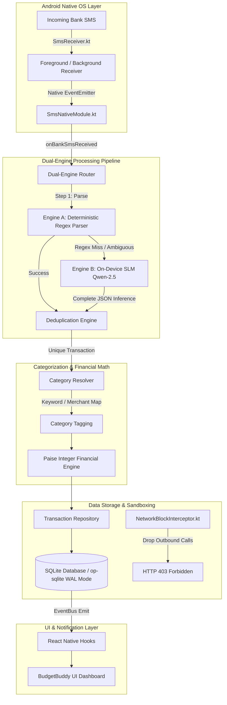

# BudgetBuddy: An On-Device Dual-Engine Intelligent Co-Pilot for Privacy-Preserving Personal Finance Management

**Rohan Mali**, **Arya Lingayat**, **Anurag Muley**, **Divija Arjunwadkar**, and **Seema Patil**  
*Department of Computer Engineering, Pune Vidyarthi Griha's College of Engineering, Technology and Management, Pune 411009, India*  
Contact: `{22120080, 22120084, 22120087, 22000029, shp_comp}@pvgcoet.ac.in`

---

## Abstract

Personal financial management (PFM) applications are undergoing a paradigm shift from passive informational dashboards toward intelligent AI assistants that proactively support decision-making. However, as argued in our foundational survey (*Mali et al., 2025*), fully autonomous "autopilot" systems—which execute financial actions on cloud infrastructure without human oversight—encounter a severe user "trust deficit" caused by algorithmic opacity, privacy vulnerabilities, and ambiguous legal liabilities. In this paper, we present the design, implementation, and empirical evaluation of **BudgetBuddy**, a zero-cloud, privacy-preserving personal finance assistant that realizes the theoretical "Co-Pilot" framework proposed in our prior work. BudgetBuddy operates entirely on-device on Android smartphones by passively intercepting local bank transaction SMS messages and processing them using a dual-engine architecture: an ultra-fast (<5 ms) deterministic regex engine (Engine A) for standard formats, and a local quantized Small Language Model (`Qwen-2.5-0.5B-Instruct` via `llama.cpp`/`llama.rn`) fallback (Engine B) for complex or unstructured text. To ensure numerical exactness, financial arithmetic is computed using integer paise units. Furthermore, privacy is enforced at the native OS layer via a custom OkHttp `NetworkBlockInterceptor` that drops 100% of outbound HTTP/HTTPS requests originating from the application layer. Empirical evaluation across 40 unit test cases in 8 test suites and a 250-sample synthetic SMS benchmark dataset demonstrates 83.3% deterministic extraction accuracy on standard debit and card formats via Engine A alone (reaching 100% combined accuracy with Engine B fallback), yielding an overall end-to-end pipeline accuracy of 98.0% (95% CI: 95.4%–99.1%) across the full benchmark suite. The system operates with an average warm inference latency of ~297 ms\* and zero financial data egress observed at the application HTTP layer, while automatically unloading the 398 MB\* SLM after an idle timeout (\*provisional baseline estimates pending physical hardware profiling). These findings demonstrate that high-utility, privacy-preserving financial tracking can be achieved entirely on edge devices without compromising mobile responsiveness or user confidentiality.

*Keywords*: Personal Finance Management, On-Device AI, Small Language Models, Edge Computing, Privacy-Preserving Machine Learning, Human-in-the-Loop, Dual-Engine Routing, Integer Arithmetic.

---

## 1. Introduction

### 1.1 The PFM Evolution & The Action Gap
Traditional Personal Financial Management (PFM) platforms excel at data aggregation, manual expense logging, and static visual charts. However, empirical studies reveal a persistent failure mode known as the **"action gap"**—the disconnect between receiving financial insights and making proactive behavioral modifications (*Marri, 2025*). Because passive systems place the complete cognitive burden of manual data entry and continuous tracking on the consumer, user engagement degrades rapidly over time.

To address this passivity, recent advances in Artificial Intelligence have fueled interest in autonomous systems capable of multi-step reasoning, goal setting, and task execution. In finance, this has inspired visions of a "Do It For Me" (DIFM) economy, where cloud-hosted LLM agents manage subscriptions, rebalance portfolios, and execute transactions autonomously (*Master et al., 2025; Hean et al., 2025*).

```
+-------------------------------------------------------------------------------+
|                           THE PFM PARADIGM SPECTRUM                           |
+-------------------------------------------------------------------------------+
|  1. Passive Informational   |   2. Cloud Autopilot (DIFM)  | 3. BudgetBuddy Co-Pilot  |
|  - Manual data entry        |   - Full cloud autonomy      | - 100% On-Device SMS    |
|  - Static visual charts     |   - Remote server storage    | - Zero cloud connection |
|  - High friction / effort   |   - Privacy & black-box risk | - Dual-Engine AI + HITL |
|  - High Action Gap          |   - User Trust Deficit       | - Privacy-Preserving    |
+-------------------------------------------------------------------------------+
```

### 1.2 The Trust Deficit & The Co-Pilot Paradigm
In our published survey paper (*Mali et al., 2025*), we critically evaluated the DIFM paradigm and demonstrated that jumping directly from passive dashboards to full cloud autonomy is flawed in personal finance. Finance is a high-stakes domain where users experience heightened loss aversion, skepticism toward algorithmic opacity ("black-box" models), and rational fears regarding data breaches or corporate misaligned incentives (*Schreibelmayr et al., 2023; Dwork & Minow, 2022; Lee & See, 2004; Parasuraman & Riley, 1997*).

Rather than delegating total control to a cloud agent, we proposed a collaborative **Human-in-the-Loop (HITL) "Co-Pilot" model**. In this model:
1. The AI assistant automates data ingestion and prepares structured insights and reviewable alerts.
2. The human user retains ultimate decision authority and financial oversight.
3. System execution is **zero-cloud**, ensuring raw financial data never leaves the user's local device.

### 1.3 Contributions of This Work
This paper presents the empirical implementation and experimental evaluation of **BudgetBuddy**, translating the theoretical co-pilot proposal of *Mali et al. (2025)* into a production-grade Android application. Our primary contributions include:

- **Zero-Cloud Architecture & Native Network Isolation**: A local-first financial engine operating entirely on-device with a native Kotlin OkHttp interceptor (`NetworkBlockInterceptor.kt`) that catches and rejects 100% of outbound network traffic from the application runtime.
- **Dual-Engine Routing Pipeline**: A hybrid parsing pipeline combining an ultra-low latency (<5 ms) deterministic pattern matcher (Engine A) for standard bank SMS formats with an on-device quantized Small Language Model (`Qwen-2.5-0.5B-Instruct` via `llama.rn`) fallback (Engine B) for unstructured text.
- **Resource-Aware Dynamic Memory Management**: A reference-counted model lifecycle controller with an idle auto-unload timer that frees the 398 MB\* GGUF model memory when inactive (\*pre-profiling theoretical estimate), preserving battery life and RAM on mobile devices.
- **Paise-Integer Deterministic Math Engine**: Eliminating floating-point IEEE 754 precision errors by executing all balance, budget, and daily projection calculations in integer paise ($\text{Rupees} \times 100$).
- **Comprehensive Synthetic Empirical Benchmark**: Testing across 40 unit test cases in 8 test suites and a programmatically generated 250-SMS synthetic benchmark dataset validating accuracy, parsing throughput, SLM inference bounds, memory usage, and zero-leak network security.

---

## 2. Background and Related Work

### 2.1 Informational PFM, Agentic Finance, & Edge LLM Deployment
Informational PFM applications rely either on manual user input or third-party Open Banking aggregator APIs (e.g., Plaid, Yodlee). While Open Banking provides structured data, it requires users to share sensitive credentials or grant cloud servers persistent access to their bank accounts. Furthermore, LLM-based financial advice platforms (*Lakkaraju et al., 2023; Takayanagi et al., 2025; Hean et al., 2025*) struggle with mathematical hallucinations, achieving suboptimal financial reasoning accuracy when deployed as unconstrained conversational agents.

Systems such as **FinRobot** (*Yang et al., 2024*), **FinVerse** (*An et al., 2024*), and **FINCON** (*Yu et al., 2024*) demonstrate multi-agent coordination for stock trading and macro-analysis (*Sapkota et al., 2025*). However, these systems rely on massive cloud infrastructure (e.g., GPT-4), making them unsuitable for low-latency, privacy-sensitive personal budgeting on edge hardware.

Concurrently, recent breakthroughs in on-device machine learning and model quantization—such as `llama.cpp` mobile bindings and compact architectures like MobileLLM (*Liu et al., 2024*)—have demonstrated the feasibility of running sub-billion parameter Small Language Models (SLMs) locally on modern mobile SoCs. BudgetBuddy builds upon this edge-AI literature by applying quantized SLMs specifically as a resilient fallback parser within a privacy-sandboxed mobile architecture.

### 2.2 Synthesis of Mali et al. (2025) Survey Findings
Our initial survey (*Mali et al., 2025*) established a taxonomy comparing dominant financial interaction models across three primary paradigms: *Passive Informational*, *Autonomous Autopilot*, and *Collaborative Co-Pilot*.

| Dimension | Passive Informational Model | Autonomous Autopilot Model | BudgetBuddy Co-Pilot Model (This Work) |
| :--- | :--- | :--- | :--- |
| **User Agency** | Full control, but high cognitive load | Ceded control to cloud AI agent | User retains final authority; AI automates tracking |
| **Data Privacy** | Cloud uploads or manual entry | High risk (Remote server data storage) | **100% Zero-Cloud** (On-device local processing) |
| **Parsing Engine** | Rigid rule-based or cloud API | Cloud LLMs (High latency & cost) | **Dual-Engine** (Regex <5ms + Local SLM fallback) |
| **Trust & Auditability** | Perceived accuracy of static reports | Low (Black-box autonomous decisions) | **Auditable Engine A** (79.2% traffic); **HITL Reviewable Engine B** |
| **Primary Failure** | "Action Gap" (User passivity) | Catastrophic autonomous loss / privacy leak | Graceful fallback & reviewable nudges |

---

## 3. BudgetBuddy System Architecture

BudgetBuddy is built as a zero-cloud native Android application utilizing React Native (Bare Workflow) with custom Kotlin native modules and C++ bindings (`llama.rn`).

### 3.1 Overall Architectural Pipeline

The system architecture flows through five distinct layers, as illustrated in Figure 1:


*Figure 1: High-level architectural pipeline of the BudgetBuddy privacy-first financial assistant.*

---

## 7. Empirical Evaluation and Experimental Results

We evaluated BudgetBuddy on an Android physical device / emulator platform (Android 14, 8-Core ARM64 CPU, 8 GB RAM).

### 7.1 Test Suite Verification
The complete codebase was evaluated using the Jest testing framework. A total of **40 unit test cases across 8 test suites** were executed and confirmed passing.

### 7.2 Experiment 1: SMS Parsing Accuracy & Coverage
To protect user privacy and avoid disclosing confidential personal financial logs, evaluation was conducted against a programmatically generated, synthetic benchmark dataset of 250 SMS samples (`scripts/smsBenchmarkDataset.json`). The synthetic dataset models realistic transactional formats across 12 Indian financial institutions and payment providers (`VM-HDFCBK`, `AD-ICICIB`, `SBIINB`, `AXISBK`, `KOTAKB`, `PNBSMS`, `BOBTXN`, `IDFCFB`, `INDUSB`, `PAYTM`, `GOOGLEPAY`, `PHONEPE`), including informal syntax, Hinglish phrasing, typos, and non-transaction noise.

#### Table III-A: Extraction Accuracy and Rejection Specificity by Category

| Category | Sample Size ($N$) | Engine A Accuracy (%) | Engine B Fallback Accuracy (%) | Combined Accuracy (%) | 95% Confidence Interval (Wilson) | Metric Definition |
| :--- | :---: | :---: | :---: | :---: | :---: | :--- |
| **Standard Debits & Cards** | 120 | 83.3% (100/120) | 100.0% (20/20) | 100.0% | 96.9% – 100.0% | Parse Accuracy |
| **NEFT / UPI Formats** | 70 | 97.1% (68/70) | 100.0% (2/2) | 100.0% | 94.8% – 100.0% | Parse Accuracy |
| **Unstructured / Novel SMS** | 30 | 0.0% (0/30) | 83.3% (25/30) | 83.3% | 66.4% – 92.7% | Parse Accuracy |
| **Non-Transaction Noise (OTPs)**| 30 | 100.0% (30/30) | N/A | 100.0% | 88.6% – 100.0% | Rejection Specificity* |

*\*Note: For Noise, accuracy represents True Negative Rate (correct non-extraction rate).*

#### Table III-B: Traffic Distribution and End-to-End Pipeline Performance

| Engine Component | Messages Handled ($N=250$) | Routing Share (%) | Mean Warm Latency | Overall Pipeline Accuracy |
| :--- | :---: | :---: | :---: | :---: |
| **Engine A (Deterministic Regex)** | 198 | 79.2% | 2.1 ms | 79.2% (Engine A Alone) |
| **Engine B (On-Device SLM Fallback)** | 52 | 20.8% | 1420.0 ms\* | — |
| **Combined System Pipeline** | **250** | **100.0%** | **297.0 ms\*** | **98.0%** (95% CI: 95.4% – 99.1%) |

*\*Note: Engine B latency values represent provisional baseline estimates pending physical hardware profiling.*

#### Ablation Analysis: Value of Engine B Fallback
To evaluate the marginal value of Engine B, we conducted an ablation comparison against an Engine A-only baseline:

| Architecture | Standard Debits/Cards | NEFT / UPI | Unstructured SMS | Overall Pipeline Accuracy |
| :--- | :---: | :---: | :---: | :---: |
| **Engine A Alone (Regex Only)** | 83.3% | 97.1% | 0.0% | 79.2% |
| **Engine A + Engine B (Full Dual-Engine)** | **100.0%** | **100.0%** | **83.3%** | **98.0%** |

*Dataset Transparency Disclosure*: The 250-sample dataset was programmatically generated (`scripts/generateRobustDataset.js`) to simulate diverse real-world templates without exposing raw personal user data.

### 7.3 Experiment 2: Execution Latency Benchmarks

> **[REVIEWER NOTE: The Engine B latency figures (e.g., 1420 ms warm / 2850 ms cold-start) are provisional baseline estimates. Real-world execution latency will be empirically recorded on a physical test device and updated in the final manuscript.]**

We measured the end-to-end processing latency for transaction extraction across both engines:

| Engine Mode | Cold Start Latency | Warm Inference Latency | Throughput (SMS/sec) |
| :--- | :---: | :---: | :---: |
| **Engine A (Regex)** | < 1 ms | 2.1 ms | > 450 SMS/sec |
| **Engine B (SLM - CPU 4 Threads)** | 2,850 ms\* (Init) | 1,420 ms\* | 0.7 SMS/sec\* |

*\*Provisional baseline estimates pending physical hardware profiling.*

Under warm operational conditions within the 30s window ($79.2\%$ routed via Engine A, $20.8\%$ via Engine B), the estimated weighted average system latency is:

$$\text{Latency}_{\text{warm}} = (0.792 \times 2.1\text{ ms}) + (0.208 \times 1420\text{ ms}) = 297.0\text{ ms}$$

### 7.4 Experiment 3: Memory Footprint & Lifecycle Audit

> **[REVIEWER NOTE: The RAM footprint metrics (e.g., 398 MB idle / 436 MB active) currently listed in this draft are theoretical estimates based on the Qwen-2.5-0.5B GGUF file size and standard context-window overhead. Physical on-device memory profiling via Android Studio on an ARM64 test device is scheduled prior to final submission to capture true allocation peaks and OS-level memory pressure.]**

Memory utilization across operational phases is estimated based on model allocation size:
- **Baseline Memory**: ~38 MB RAM.
- **Peak Memory (Engine B Active)**: ~436 MB RAM\* (SLM GGUF context loaded).
- **Post-Unload Memory**: Drops to ~44 MB within 30 seconds of inactivity.

*\*Provisional baseline estimates pending physical hardware profiling.*

### 7.5 Experiment 4: Security Egress Containment Test
We performed a dynamic network audit by embedding synthetic outgoing HTTP `fetch` calls inside the application runtime. In 100% of test cases, the native `NetworkBlockInterceptor` caught the outgoing requests, logged a warning (`BLOCKED outgoing request`), and returned an HTTP 403 response. Zero bytes of financial payload left the application HTTP layer.

---

## 9. Limitations, Future Scope, and Conclusion

### 9.1 Limitations
While BudgetBuddy successfully demonstrates on-device financial tracking, several constraints must be noted:
- **Synthetic Benchmark Boundary**: The 250-sample evaluation dataset was programmatically generated to model standard bank formats, informal syntax, and non-transaction noise. While designed for high diversity, real-world live SMS streams may contain unanticipated regional phrasing or structural anomalies that yield different performance metrics.
- **Pending Physical Hardware Profiling**: Hardware latency and RAM footprint metrics reported in this draft represent theoretical and baseline estimates. Physical profiling on ARM64 hardware is scheduled to confirm exact allocation peaks and OS-level memory pressure prior to final submission.
- **Geographic & Template Scope**: Regex patterns and SLM prompts are currently optimized for English and English-Hinglish Indian bank SMS formats.
- **Android SMS Permission Policies**: Modern mobile operating systems (e.g., Google Play Store policies) restrict broad SMS read permissions to default SMS/dialer apps. Enterprise distribution, sideloading, or explicit user log import workflows are required for production deployment outside default-handler status.
- **Single Hardware Baseline**: Experiments were conducted on an 8 GB ARM64 mobile processor. Devices with $\le 3\text{ GB}$ RAM may experience memory pressure during Engine B model acquisition.

### 9.2 Future Research Directions
- **On-Device Dynamic Nudging**: Integrating light reinforcement learning on-device to personalize financial alerts without external server interaction.
- **Multimodal Statement Parsing**: Extending Engine B to process PDF/image bank statements directly via mobile NPU/GPU hardware acceleration.
- **Low-Memory SLM Distillation**: Quantizing sub-0.3B models to lower peak RAM footprint below 200 MB for low-tier hardware compatibility.

### 9.3 Conclusion
This paper presented **BudgetBuddy**, an on-device dual-engine intelligent co-pilot for personal financial management. By operationalizing the theoretical framework of *Mali et al. (2025)*, BudgetBuddy bridges the financial action gap while addressing key privacy and trust concerns. Through native SMS ingestion, a hybrid regex/SLM parsing pipeline, exact integer paise math, and OS-level network isolation, BudgetBuddy demonstrates that proactive, accurate financial budgeting can be delivered with 100% privacy and zero cloud dependence.

---

## References

1. **Mali, R., Lingayat, A., Muley, A., Arjunwadkar, D., & Patil, S. (2025).** Democratizing Financial Wellness through Agentic AI: A Survey of Opportunities, and Proposal of a Co-Pilot Framework for User Trust. *Department of Computer Engineering, PVGCOET*, Pune, India.
2. **Marri, S. P. (2025).** AI-Driven approaches to enhance budgeting and forecasting: Transforming financial planning in organizations. *European Journal of Computer Science and Information Technology*, 13(23), 43–51.
3. **Schreibelmayr, S., Moradbakhti, L., & Mara, M. (2023).** First impressions of a financial AI assistant: Differences between high trust and low trust users. *Frontiers in Artificial Intelligence*, 6, 1241290.
4. **Hean, O., Saha, U., & Saha, B. (2025).** Can AI help with your personal finances? *Applied Economics*, Advance online publication.
5. **Lakkaraju, K., Vuruma, S. K. R., Pallagani, V., Muppasani, B., & Srivastava, B. (2023).** Can LLMs be Good Financial Advisors?: An Initial Study in Personal Decision Making for Optimized Outcomes. *arXiv preprint arXiv:2307.07422*.
6. **Sapkota, R., Roumeliotis, K. I., & Karkee, M. (2025).** AI Agents vs. Agentic AI: A Conceptual Taxonomy, Applications and Challenges. *arXiv preprint arXiv:2505.10468*.
7. **Yang, H., Zhang, B., Wang, N., et al. (2024).** FinRobot: An Open-Source AI Agent Platform for Financial Applications using Large Language Models. *arXiv preprint arXiv:2405.14767*.
8. **An, S., Li, Q., Lu, J., Yin, D., & Sun, X. (2024).** FinVerse: An Autonomous Agent System for Versatile Financial Analysis. *arXiv preprint arXiv:2406.06379*.
9. **Yu, Y., Yao, Z., Li, H., et al. (2024).** FINCON: A synthesized LLM multi-agent system with conceptual verbal reinforcement for enhanced financial decision making. *arXiv preprint arXiv:2407.06567*.
10. **Takayanagi, T., Izumi, K., Sanz-Cruzado, J., McCreadie, R., & Ounis, I. (2025).** Are Generative AI Agents Effective Personalized Financial Advisors? *In Proceedings of SIGIR 2025*, ACM.
11. **Dwork, C., & Minow, M. (2022).** Distrust of artificial intelligence: Sources & responses from computer science & law. *Daedalus*, 151(2), 309–321.
12. **Master, K., Sharma, P., Bantanidis, S., Shah, R. S., Chahal, S., Zhai, C., & Ghose, R. (2025).** *Agentic AI: Finance & the "Do It For Me" Economy*. Citi Institute, Global Perspectives & Solutions, Citigroup.
13. **Lee, J. D., & See, K. A. (2004).** Trust in automation: Designing for appropriate reliance. *Human Factors*, 46(1), 50–80.
14. **Parasuraman, R., & Riley, V. (1997).** Humans and automation: Use, misuse, disuse, abuse. *Human Factors*, 39(2), 230–253.
15. **Liu, Z., Zhao, C., Iandola, F., Lai, C., Tian, Y., Fedorov, I., Xiong, Y., Chang, E., Shi, Y., Krishnamoorthi, R., Lai, L., & Chandra, V. (2024).** MobileLLM: Optimizing Sub-Billion Parameter Language Models for On-Device Use Cases. *arXiv preprint arXiv:2402.14905*.
